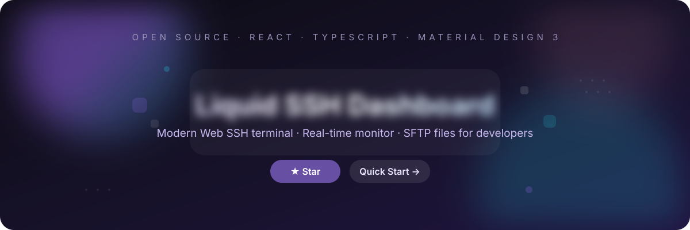
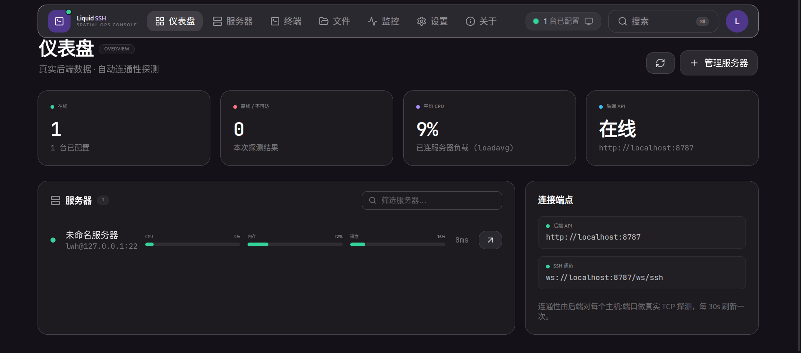
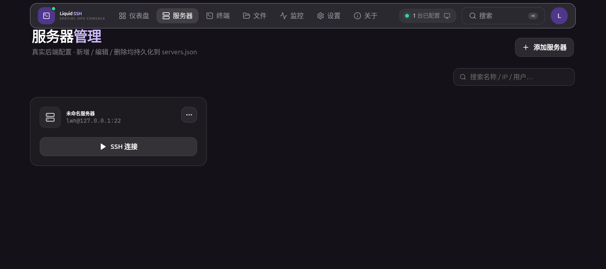
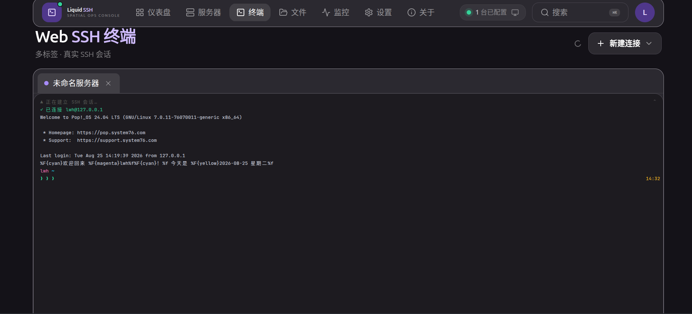
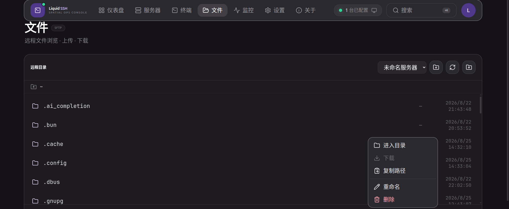
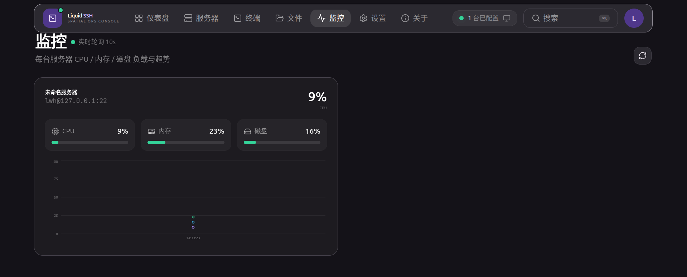
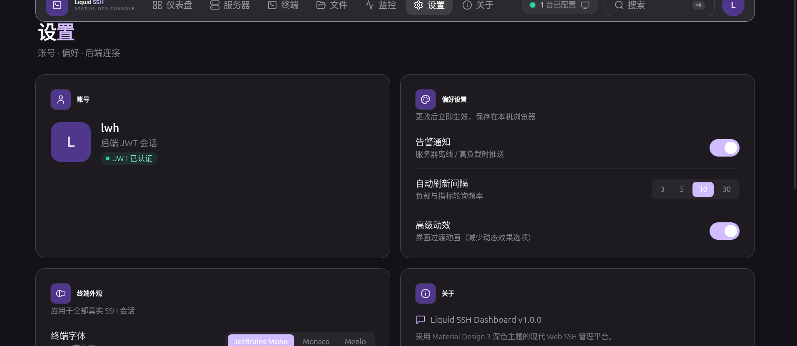
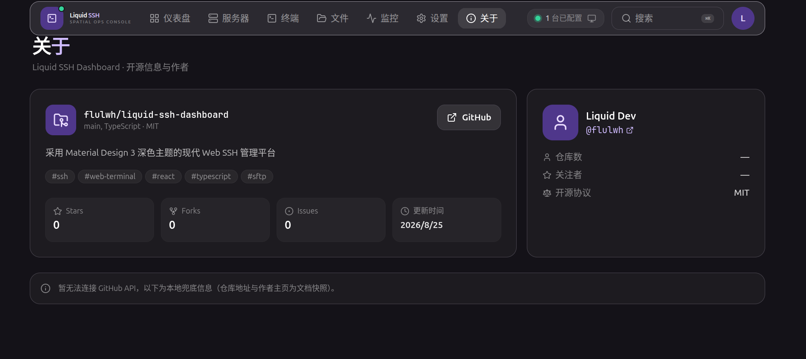

<p align="center">
  
</p>

<h3 align="center">A modern Web SSH terminal &amp; server management platform — React + TypeScript + Material Design 3</h3>

<p align="center">
  <a href="#features">Features</a> ·
  <a href="#screenshots">Screenshots</a> ·
  <a href="#quick-start">Quick Start</a> ·
  <a href="#tech-stack">Tech Stack</a> ·
  <a href="#roadmap">Roadmap</a> ·
  <a href="#contributing">Contributing</a>
</p>

<p align="center">
  
  
  
  
  
  
</p>

---

> ## ⭐ If this project helps you, please consider giving it a star. It motivates future development.

---

## ✨ Features

- 🌐 **Real SSH Terminal** — interactive sessions over WebSocket (xterm.js), multi-tab, remote resize, 1000-line scrollback.
- 📊 **Live Monitoring** — real CPU / memory / disk collected via SSH, with historical trend charts.
- 📁 **SFTP File Manager** — browse remote directories, upload / download files, with context menu (rename · delete · copy path · new folder).
- 📡 **Server Dashboard** — TCP reachability probing + per-server real-time load (loadavg / free / df).
- 🖥 **Server Management** — search / add / edit / delete servers, persisted to the backend `servers.json`.
- 🔐 **Accounts &amp; JWT Auth** — register &amp; log in from the UI; **no hard-coded credentials, no mock data anywhere**.
- ⚙️ **Preferences** — terminal font/size, refresh interval, reduced motion (persisted in browser).
- ⌨️ **Command Palette** — `Ctrl+K` / `⌘K` global search &amp; quick actions.
- 🧩 **One-command start** — cross-platform script launches frontend + backend together; stop with `Ctrl+C`.

## 📸 Screenshots

### Dashboard — real load, real reachability
<p align="center">
  
</p>

### Servers — search, add, edit, delete (persisted on backend)
<p align="center">
  
</p>

### Web SSH Terminal — real xterm.js session over WebSocket
<p align="center">
  
</p>

### Files — SFTP browser with context menu
<p align="center">
  
</p>

### Monitoring — CPU / memory / disk + trend curves
<p align="center">
  
</p>

### Settings — account, preferences, backend connection
<p align="center">
  
</p>

### About — GitHub repository info
<p align="center">
  
</p>

## 🚀 Quick Start

Requires **Node.js 18+**. One command for everything (frontend + backend):

```bash
# install all dependencies
npm install && (cd server && npm install)

# start frontend + backend together (cross-platform)
npm run dev:all
```

Then open **http://localhost:5173/**, register the first account at the login screen, add a server, and connect.

> The one-click script [`scripts/dev.mjs`](scripts/dev.mjs) starts both the Vite frontend and the Node backend together on **Windows / macOS / Linux**. Stop everything with `Ctrl+C`.

## 📦 Installation

```bash
git clone https://github.com/flulwh/liquid-ssh-dashboard.git
cd liquid-ssh-dashboard

# frontend
npm install

# backend
cd server && npm install && cp servers.example.json servers.json && cd ..
```

Backend config (optional):

```bash
cd server && cp .env.example .env   # optional env vars
```

Production build:

```bash
# type-check + build
npm run build

# preview the build
npm run preview
```

## 🛠 Tech Stack

| Area | Choice |
| --- | --- |
| Frontend | React 18 · TypeScript · Vite 5 |
| Styling | Tailwind CSS 3 (Material Design 3 design system, dark theme) |
| Animation | Framer Motion |
| State | Zustand |
| Terminal | xterm.js (`@xterm/xterm` + `@xterm/addon-fit`) |
| SSH Backend | Node.js · Express · ssh2 · ws · jsonwebtoken (`server/`) |
| File Transfer | ssh2 SFTP (list / upload / download / rename / delete / mkdir) |
| Charts | Recharts |
| Routing | react-router-dom |
| Icons | lucide-react |

## 🧭 Why this project?

- **Real, not demo** — the frontend ships **zero mock data**. Every server, account, and metric comes from the live backend (`servers.json` / `users.json`).
- **Truly local &amp; private** — everything runs on your machine; your SSH credentials never leave it.
- **Clean, focused UI** — a restrained **Material Design 3** dark surface (seed color `#6750A4`) instead of flashy gradients, built for readability.
- **Fast to adopt** — one command starts the whole stack; it's a solid template for a modern React + WebSocket + SSH admin tool.
- **Familiar to operators** — terminal, SFTP, real load — everything you need at a glance.

## 🗺 Roadmap

- [ ] GitHub Actions CI (type-check + build on every push)
- [ ] Docker one-command deployment (frontend + backend + nginx)
- [ ] SSH key management in the UI
- [ ] Multi-user RBAC / team workspaces
- [ ] Session recording &amp; playback
- [ ] i18n (EN / 中文)
- [ ] Custom theme color picker (dynamic MD3 color)
- [ ] Hosted live demo (Docker / Fly.io)

## 🤝 Contributing

Contributions, issues and feature requests are welcome!

1. **Fork** the repo
2. Create a feature branch: `git checkout -b feat/my-feature`
3. Commit your changes
4. Push &amp; open a **Pull Request**

Please keep commits focused and descriptive. See the open [Issues](https://github.com/flulwh/liquid-ssh-dashboard/issues) for ideas.

## 📄 License

This project is released under the **MIT License** (see `LICENSE`). Feel free to use, modify, and redistribute. If you use or reference this project, please credit the original author.

## 🔗 Links

- 👤 Author — [@flulwh](https://github.com/flulwh)
- 🌐 Repo — https://github.com/flulwh/liquid-ssh-dashboard
- 🐛 Issues — https://github.com/flulwh/liquid-ssh-dashboard/issues

---

## Details for developers

### API contract (backend, `server/`)

| Method | Path | Description |
| --- | --- | --- |
| POST | `/api/auth/login` | Login → JWT |
| GET | `/api/servers` | Sanitized server list |
| WS | `/ws/ssh?serverId=&token=&cols=&rows=` | Interactive SSH channel |
| GET | `/api/files/list?serverId=&path=` | List remote directory |
| POST | `/api/files/upload?serverId=&path=&name=` | Upload file (binary body) |
| GET | `/api/files/download?serverId=&path=` | Download file |

> In production, put the backend behind a reverse proxy with `wss://` + HTTPS.

### Project structure

```
liquid-ssh-dashboard/
├── assets/                       # project banner + screenshots
├── index.html
├── vite.config.ts
├── tailwind.config.js            # MD3 design tokens
├── scripts/dev.mjs               # cross-platform one-click start/stop
├── server/                       # Node.js + ssh2 + ws + SFTP backend
│   ├── servers.example.json      # server config (copy to servers.json)
│   └── src/{index,config,auth,ssh}.ts
└── src/
    ├── api/client.ts             # API / WS client (auth · files)
    ├── store/                    # Zustand (auth · servers · ui · terminal)
    ├── hooks/                    # useServerLoads, useServerReachability …
    ├── components/               # RealTerminal, FileManager, ServerCard …
    ├── layouts/AppLayout.tsx
    └── pages/                    # Dashboard · Servers · Terminal · Files · Monitoring · Settings · About
```

### Deployment

**Any static host (Vercel / Netlify / Cloudflare Pages)** — build static files go to `dist/`. Since the app uses `BrowserRouter`, configure SPA fallback:

- **Vercel** — `vercel.json`:
  `{ "rewrites": [{ "source": "/(.*)", "destination": "/index.html" }] }`
- **Netlify** — `public/_redirects` with `/*  /index.html  200`

**Nginx**

```nginx
server {
  listen 80;
  server_name your-domain.com;
  root /var/www/liquid-ssh-dashboard/dist;
  index index.html;
  location / { try_files $uri $uri/ /index.html; }
}
```

**Docker**

```dockerfile
FROM node:20-alpine AS build
WORKDIR /app
COPY package*.json ./
RUN npm ci
COPY . .
RUN npm run build

FROM nginx:alpine
COPY --from=build /app/dist /usr/share/nginx/html
COPY nginx.conf /etc/nginx/conf.d/default.conf
EXPOSE 80
```

```bash
docker build -t liquid-ssh-dashboard .
docker run -p 8080:80 liquid-ssh-dashboard
```

### Design notes

- **Material Design 3** dark theme: `surface-container` surfaces, seed color `#6750A4` (default purple) producing the primary / primary-container palette.
- Cards use restrained MD3 surface material (hairline border + elevation), no glass blur / gradient glows.
- Motion respects `prefers-reduced-motion`; can also be disabled in **Settings → Preferences** (`MotionConfig reducedMotion`).

---

<p align="center"><sub>Made with ❤️ by <a href="https://github.com/flulwh">flulwh</a> · React Dashboard · TypeScript · Open Source</sub></p>